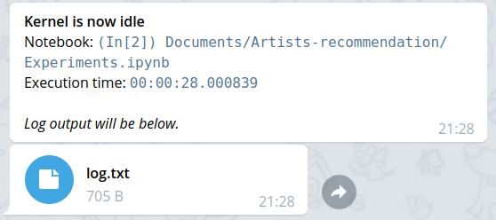

# exec-notifier nbextension
Jupyter notebook extension to send you information about looong executed command when it is done.
Information will be sent using Telegram [@exec_notifier](https://telegram.me/exec_notifier_bot) Bot.
Logs and execution time (if they'll occur) will be delivered too.

Extension is a perfect fit for such cases as:
* long ML model learning
* you need to leave but want to be notified about results of execution

## How to start using

1. Telegram ID - get it from [@exec_notifier_bot](https://telegram.me/exec_notifier_bot) by using `/start` command.
2. Provide ID to settings on Nbextension page.
3. Set minimum execution time after which notification willl be sent (in the notebook).

## Information
Also this tool is provided as python package which you can install from [pip](https://pypi.org/project/exec-notifier) and use as CLI tool.

This code is updated code from [notify](https://github.com/sjpfenninger/ipython-extensions) nbextension by [@sjpfenninger](https://github.com/sjpfenninger).
